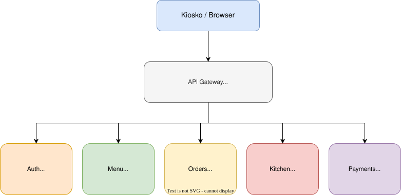

# tap&Chew 🍔

Sistema de autoservicio para restaurantes inspirado en los kioskos de McDonald's.
El cliente interactúa con una pantalla táctil, arma su pedido, paga
y la cocina lo recibe en tiempo real.

## Arquitectura

Sistema basado en microservicios con API Gateway centralizado.

## Microservicios

| Servicio         | Framework | Base de datos | Puerto | Estado     |
|------------------|-----------|---------------|--------|------------|
| API Gateway      | Express   | —             | 8000   | Listo    |
| Auth Service     | Laravel   | MySQL         | 8001   | Listo    |
| Menu Service     | Django    | PostgreSQL    | 8002   | Listo    |
| Order Service    | Express   | Firebase      | 8003   | Listo    |
| Kitchen Service  | Flask     | MySQL         | 8004   | Listo    |
| Payment Service  | Express   | MongoDB       | 8005   | Listo    |

## Entrega #1 — Implementación inicial

**Fecha:** 4 de abril de 2026

- [x] Auth Service — Laravel + MySQL
- [x] Menu Service — Django + PostgreSQL
- [x] Order Service — Express + Firebase
- [x] Kitchen Service — Flask + MySQL
- [x] Payment Service — Express + MongoDB
- [X] API Gateway — Express
- [x] Diagrama de arquitectura
- [X] Documentación de endpoints

## Levantar el sistema (desarrollo local)

Instrucciones por servicio en sus respectivos README:

- [Auth Service](services/auth-service/README.md)
- [Menu Service](services/menu-service/README.md)
- [Order Service](services/order-service/README.md)
- [Kitchen Service](services/kitchen-service/README.md)
- [Payment Service](services/payment-service/README.md)

## Repositorio

Cada servicio tiene su rama `feature/nombre-servicio`.
La rama `develop` integra todos los servicios.
`main` recibe merges al finalizar cada entrega.

## Entrega #1 completada

> Tag: `v1.0-entrega1` — rama `main`